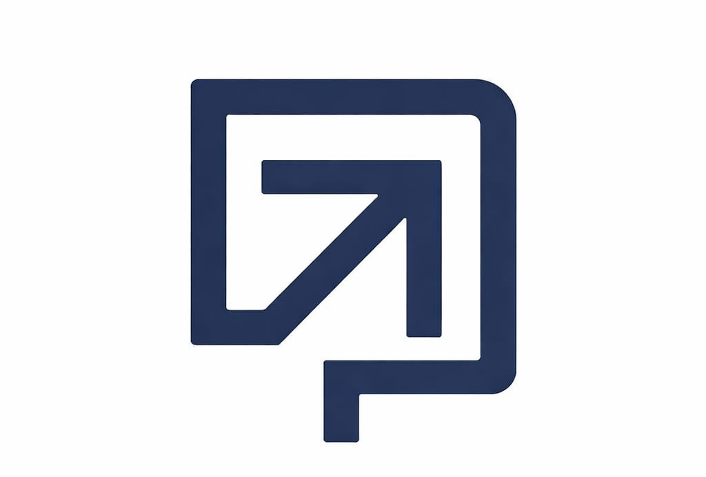

<div align="center">
    <a href="https://webmax-erp.site">
	
    </a>
    <h2>WEBMAX</h2>
    <p align="center">
        <p>نظام ERP قوي، بديهي ومفتوح المصدر</p>
    </p>

[](https://webmax-erp.site)<br><br>
[](https://github.com/webmax/webmax/actions/workflows/server-tests-mariadb.yml)
[](https://hub.docker.com/r/webmax/webmax-worker)

</div>

<div align="center">
	
</div>

<div align="center">
	<a href="https://webmax-erp.site/api/method/webmax_demo.webmax_demo.auth.login_demo">العرض التجريبي المباشر</a>
	-
	<a href="https://webmax-erp.site">الموقع الإلكتروني</a>
	-
	<a href="https://docs.webmax-erp.site">التوثيق</a>
</div>

## WEBMAX

نظام ERP مفتوح المصدر 100% لمساعدتك في إدارة أعمالك.

### الدافع

إدارة الأعمال هي مهمة معقدة - التعامل مع الفواتير، تتبع المخزون، إدارة الموارد البشرية والمزيد من الأنشطة المختلفة. في سوق يُباع فيه البرنامج بشكل منفصل لإدارة كل من هذه المهام، يقوم WEBMAX بكل ما سبق وأكثر، مجاناً.

### المميزات الرئيسية

- **المحاسبة**: جميع الأدوات التي تحتاجها لإدارة التدفق النقدي في مكان واحد، من تسجيل المعاملات إلى تلخيص وتحليل التقارير المالية.
- **إدارة الطلبات**: تتبع مستويات المخزون، تجديد المخزون، وإدارة أوامر المبيعات، والعملاء، والموردين، والشحنات، والتسليمات، وإتمام الطلبات.
- **التصنيع**: يبسط دورة الإنتاج، ويساعد في تتبع استهلاك المواد، ويعرض تخطيط السعة، ويتعامل مع التعاقد من الباطن، والمزيد!
- **إدارة الأصول**: من الشراء إلى التلف، البنية التحتية للتكنولوجيا إلى المعدات. غطِ كل فرع من فروع مؤسستك، كل ذلك في نظام مركزي واحد.
- **المشاريع**: تسليم المشاريع الداخلية والخارجية في الوقت المحدد، والميزانية، والربحية. تتبع المهام، وجداول العمل، والمشكلات حسب المشروع.

<details open>

<summary>More</summary>
	
	
	
	
</details>

### تحت الغطاء

- [**إطار Frappe**](https://github.com/frappe/frappe): إطار تطبيقات ويب متكامل مكتوب بلغة Python و Javascript. يوفر الإطار أساساً قوياً لبناء تطبيقات الويب، بما في ذلك طبقة تجريد قاعدة البيانات، ومصادقة المستخدم، وواجهة برمجة التطبيقات REST API.

- [**Frappe UI**](https://github.com/frappe/frappe-ui): مكتبة واجهة مستخدم قائمة على Vue، لتوفير واجهة مستخدم حديثة. توفر مكتبة Frappe UI مجموعة متنوعة من المكونات التي يمكن استخدامها لبناء تطبيقات صفحة واحدة فوق إطار Frappe.

## الإعداد الإنتاجي

### الاستضافة المدارة

يمكنك تجربة [WEBMAX Cloud](https://webmax-erp.site)، منصة بسيطة وسهلة الاستخدام ومتطورة [مفتوحة المصدر](https://github.com/webmax/press) لاستضافة تطبيقات Frappe بأمان وراحة بال.

تعتني بالتثبيت، والإعداد، والترقيات، والمراقبة، والصيانة، والدعم لنشر WEBMAX الخاص بك. إنها منصة مطورين كاملة الميزات مع القدرة على إدارة والتحكم في عمليات نشر WEBMAX المتعددة.

<div>
	<a href="https://webmax-erp.site/app/home" target="_blank">
		<picture>
			<source media="(prefers-color-scheme: dark)" srcset="https://webmax-erp.site/files/try-on-wc-white.png">
			
		</picture>
	</a>
</div>


### الاستضافة الذاتية
#### Docker

المتطلبات المسبقة: docker، docker-compose، git. راجع [توثيق Docker](https://docs.docker.com) لمزيد من التفاصيل حول إعداد Docker.

شغل الأوامر التالية:

```
git clone https://github.com/webmax/webmax_docker
cd webmax_docker
docker compose -f pwd.yml up -d
```

بعد بضع دقائق، يجب أن يكون الموقع متاحاً على localhost المنفذ: 8080. استخدم بيانات اعتماد تسجيل الدخول الافتراضية التالية للوصول إلى الموقع.
- اسم المستخدم: Administrator
- كلمة المرور: admin

راجع [WEBMAX Docker](https://github.com/webmax/webmax_docker?tab=readme-ov-file#to-run-on-arm64-architecture-follow-this-instructions) لإعداد Docker على ARM.


## إعداد التطوير
### التثبيت اليدوي

الطريقة السهلة: برنامج التثبيت الخاص بنا لـ bench سيثبت جميع التبعيات (مثل MariaDB). راجع https://github.com/webmax/bench لمزيد من التفاصيل.

سيتم إنشاء كلمات مرور جديدة لمستخدم WEBMAX "Administrator"، ومستخدم root MariaDB، ومستخدم frappe (يعرض البرنامج كلمات المرور ويحفظها في ~/webmax_passwords.txt).


### المحلي

لإعداد المستودع محلياً، اتبع الخطوات المذكورة أدناه:

1. إعداد bench باتباع [خطوات التثبيت](https://frappeframework.com/docs/user/en/installation) وابدأ الخادم
   ```
   bench start
   ```

2. في نافذة طرفية منفصلة، شغل الأوامر التالية:
   ```
   # إنشاء موقع جديد
   bench new-site webmax.localhost
   ```

3. احصل على تطبيق WEBMAX وثبته
   ```
   # احصل على تطبيق WEBMAX
   bench get-app https://github.com/webmax/webmax

   # ثبت التطبيق
   bench --site webmax.localhost install-app webmax
   ```

4. افتح الرابط `http://webmax.localhost:8000/app` في متصفحك، يجب أن ترى التطبيق يعمل

## التعلم والمجتمع

1. [WEBMAX School](https://school.webmax-erp.site) - تعلم إطار Frappe و WEBMAX من الدورات المختلفة التي يقدمها المشرفون أو من المجتمع.
2. [التوثيق الرسمي](https://docs.webmax-erp.site) - توثيق شامل لـ WEBMAX.
3. [منتدى النقاش](https://discuss.webmax-erp.site/c/webmax/6) - تفاعل مع مجتمع مستخدمي ومقدمي خدمات WEBMAX.
4. [مجموعة Telegram](https://webmax_public.t.me) - احصل على مساعدة فورية من مجتمع كبير من المستخدمين.


## المساهمة

1. [إرشادات الإصدار](https://github.com/webmax/webmax/wiki/Issue-Guidelines)
1. [الإبلاغ عن الثغرات الأمنية](https://webmax-erp.site/security)
1. [متطلبات طلب السحب](https://github.com/webmax/webmax/wiki/Contribution-Guidelines)
2. [الترجمات](https://crowdin.com/project/webmax)


## سياسة الشعار والعلامة التجارية

يرجى قراءة [سياسة الشعار والعلامة التجارية](TRADEMARK_POLICY.md).

<br />
<br />
<div align="center" style="padding-top: 0.75rem;">
	<a href="https://frappe.io" target="_blank">
		<picture>
			<source media="(prefers-color-scheme: dark)" srcset="https://frappe.io/files/Frappe-white.png">
			
		</picture>
	</a>
</div>
